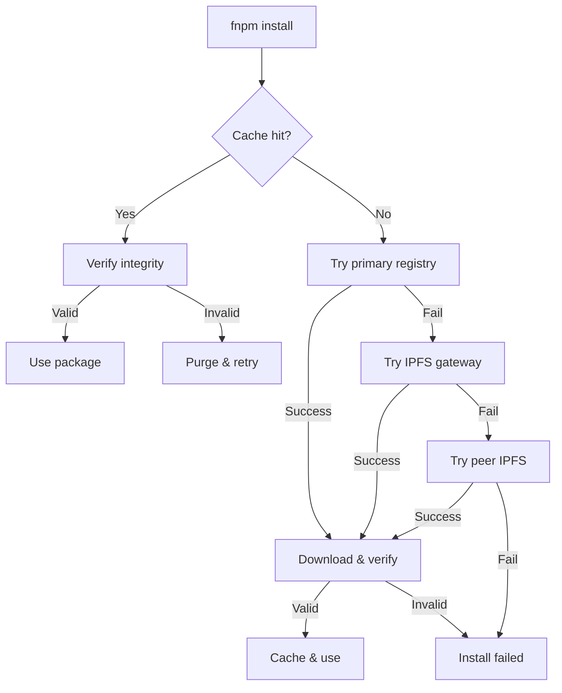

# RFC 0001: FNPM Integrity & IPFS Fallback

## Summary

Implement cryptographic integrity verification for all FNPM packages with automatic IPFS fallback for resilient, decentralized package distribution.

## Motivation

Current package managers suffer from:
- Single point of failure (registry down = no installs)
- No offline verification of package integrity
- Centralized control over package availability

FNPM solves this through:
- SHA256 integrity hashes for every package
- IPFS content-addressed storage as fallback
- Local verification without network calls

## Detailed Design

### 1. Integrity Format

```typescript
interface PackageIntegrity {
  algorithm: 'sha256' | 'sha512';
  hash: string; // base64 encoded
  size: number; // bytes
  ipfsCid?: string; // IPFS content identifier
}
```

### 2. Manifest Extension

```json
{
  "name": "glyph://consciousness@quantum",
  "version": "1.0.0",
  "integrity": {
    "algorithm": "sha256",
    "hash": "lB3Hd3i4D2eLQmFybgZJGJhgNlaGTgAy7jIj1E23AUI=",
    "size": 45632,
    "ipfsCid": "QmYwAPJzv5CZsnA625s3Xf2nemtYgPpHdWEz79ojWnPbdG"
  }
}
```

### 3. Resolution Flow



### 4. IPFS Integration

```typescript
class IPFSResolver {
  private gateways = [
    'https://ipfs.io/ipfs/',
    'https://gateway.pinata.cloud/ipfs/',
    'https://cloudflare-ipfs.com/ipfs/'
  ];
  
  async resolve(cid: string): Promise<Buffer> {
    // Try gateways in order
    for (const gateway of this.gateways) {
      try {
        return await fetch(`${gateway}${cid}`);
      } catch (e) {
        continue;
      }
    }
    
    // Fall back to local IPFS node
    return await this.resolveLocal(cid);
  }
}
```

## Alternatives Considered

1. **Torrent-based distribution**: More complex, less web-friendly
2. **Blockchain registry**: Too slow for package resolution
3. **Custom P2P protocol**: Reinventing IPFS poorly

## Implementation Plan

### Phase 1: Integrity (Sprint 1)
- [ ] Add integrity calculation to publish flow
- [ ] Implement verification in install flow
- [ ] Add CLI commands: `fnpm verify`, `fnpm integrity`

### Phase 2: IPFS (Sprint 2)
- [ ] IPFS publish integration
- [ ] Gateway fallback logic
- [ ] Local IPFS node support

### Phase 3: Optimization (Sprint 3)
- [ ] Parallel gateway attempts
- [ ] Smart gateway selection
- [ ] Peer discovery for local network

## Success Metrics

- Install success rate > 99.5% (with at least one mirror up)
- Integrity verification < 50ms for average package
- IPFS fallback activation < 5% of installs

## Security Considerations

- Package authors control initial integrity hash
- Once published, immutable (no force-push)
- Trust on first use (TOFU) for new packages
- Community-maintained integrity audit log

## Open Questions

1. Should we support multiple hash algorithms?
2. How long to pin packages on IPFS?
3. Community gateway vs. self-hosted?